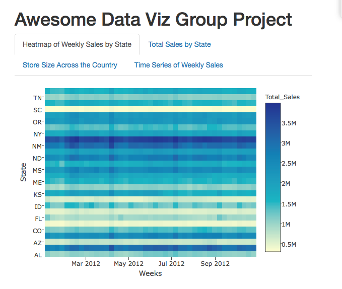
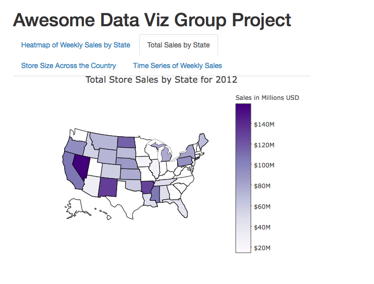
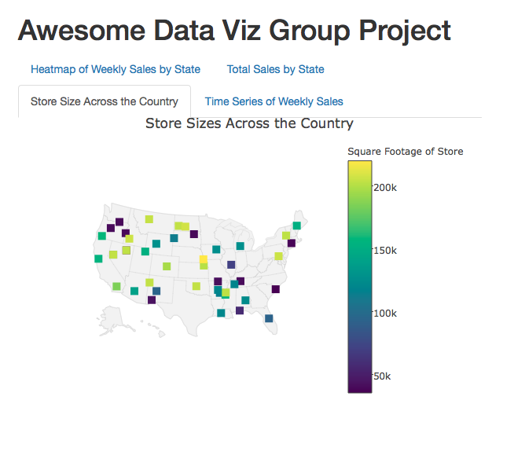
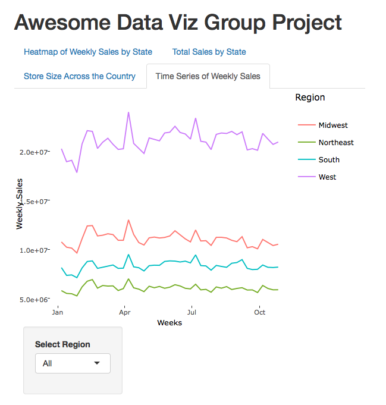

# Data Viz Project

### Members
* Hannah Leiber: hkleiber@usfca.edu
* Dominic Vantman: dvantmanluft@usfca.edu

### Instructions
In order to run this code you must have the following package installed
* reshape2
* plotly
* ggplot2
* tidyr
* shiny

You can download the code and data files here:

https://github.com/usfviz/awesome-dataviz-team-/archive/master.tar.gz

Running this command will start the shiny app and allow you to interact with it.

### Data Description
Historical sales data for 45 Walmart stores located in different regions

Features:
* Store - the store number (categorical)
* Dept - the department number (categorical)
* Date - the week (timestamp)
* Weekly_Sales -  sales for the given department in the given store (numerical)
* IsHoliday - whether the week is a special holiday week (categorical)
* State - state where store is located

### User Interface
The current UI has a tab for each separate visualization of the data. This is a helpful layout as the user will not be confused what interaction goes with what visualization. Currently, the theme is standard shiny but we can change this and make it look a little nicer for the finished product.

**Heatmap**:
This technique shows weekly sales by State, providing a nice way to see which weeks and States throughout the year have the most sales. This visualization implements hover and zoom to provide more detailed information to the viewer.

**Map of Total Sales by State**:
This visualization shows the total store sales in 2012 broken down by state. The main interaction for this visualization is hover.

**Map of Store Size Across the Country**:
This visualization shows size of the stores across the country. This allows to understand sales relative to size of the store. The main interaction for this visualization is hover.

**Time Series of Weekly Sales**:
Provides another way of looking at the weekly sales by region and store. This visualization implements hover and zoom. You can also click on a region to remove it from the plot, allowing you to focus in on only the regions you are interested in.

